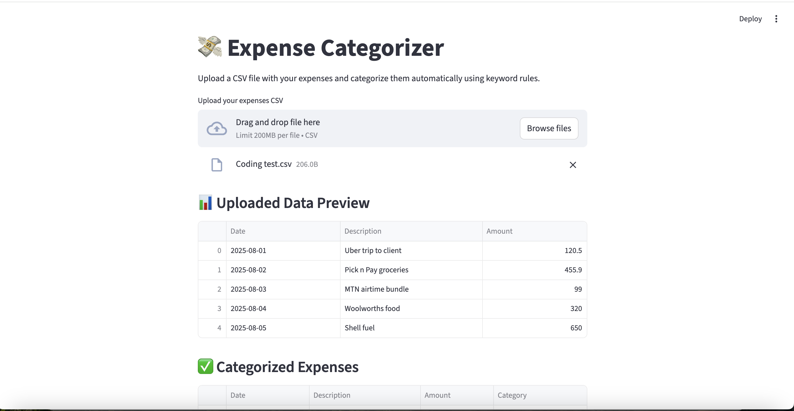

# Expense Categorizer  

  

This project is a Streamlit-based expense categorizer that allows users to upload a CSV of transactions and automatically assign them to categories such as Travel, Food, Utilities, Business Expenses, etc.

It is part of my Chartered Accountant + AI portfolio, where I combine financial expertise with Python, data analysis, and AI tools to build practical finance automation apps. The goal of this project is to showcase how accounting knowledge can be translated into real-world software solutions that streamline decision-making and reporting.

🚀 Features

•	Upload CSV/Excel with your expenses 💸
•	Auto-categorization into common categories 🗂️
•	Download results as CSV/Excel 📊
•	Clean Streamlit web UI ⚡
•	Easily customizable categories to fit your needs
Installation

Clone the repository:

git clone https://github.com/Tshepo206/expense-categorizer.git cd expense-categorizer

Create and activate a virtual environment:

python3 -m venv .venv source .venv/bin/activate # Mac/Linux .venv\Scripts\activate # Windows

Install dependencies:

pip install -r requirements.txt

▶️ Run the App:

streamlit run streamlit_app.py

The app will open in your browser at: 👉 http://localhost:8501

Tech stack:

Python Streamlit Pandas

License:

MIT License — feel free to use and modify.

Contributing:

Pull requests are welcome! If you’d like to add new features (e.g. charts, AI categorization, or budget tracking), feel free to fork this repo and open a PR.

Show your support:

If you like this project, please star the repo ⭐ on GitHub — it helps others discover it!
## Demo

